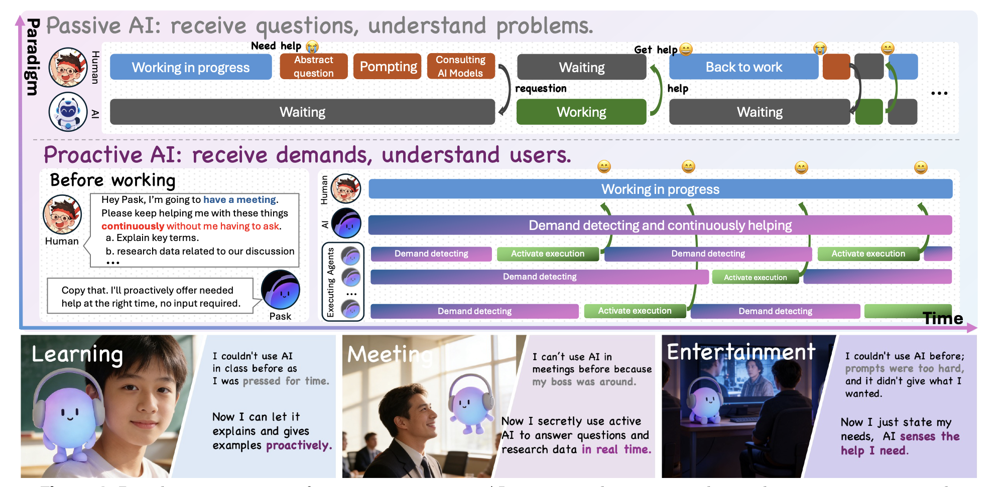
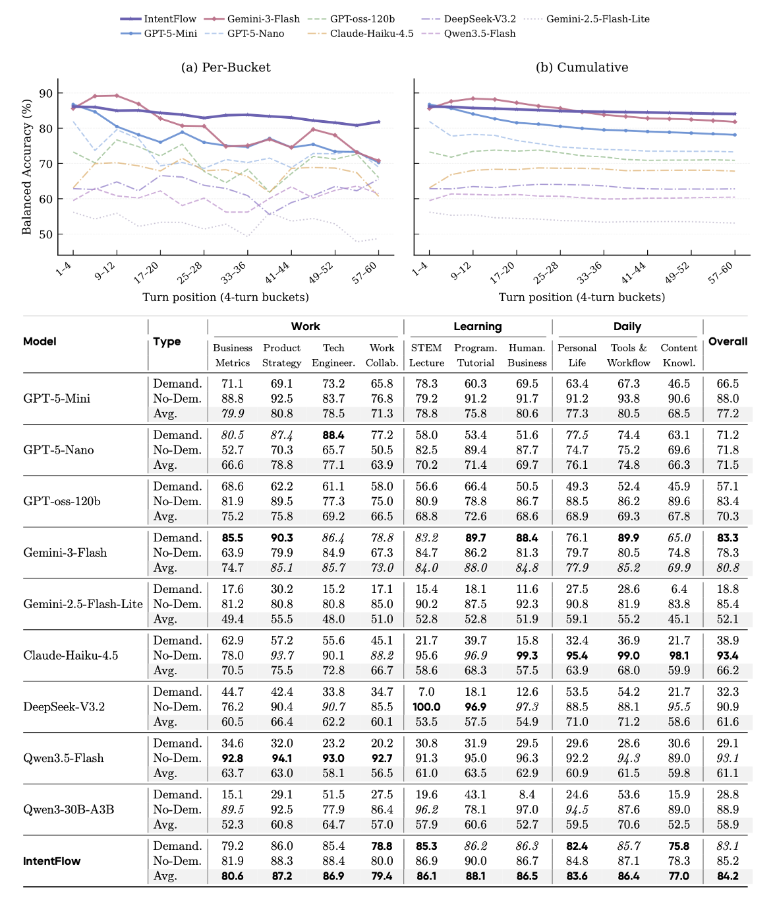
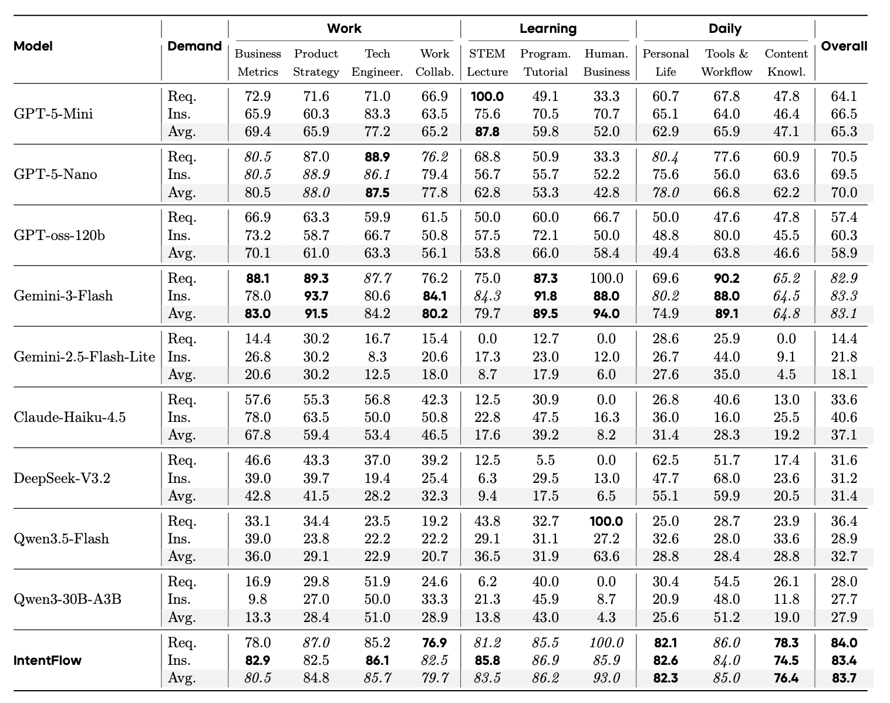
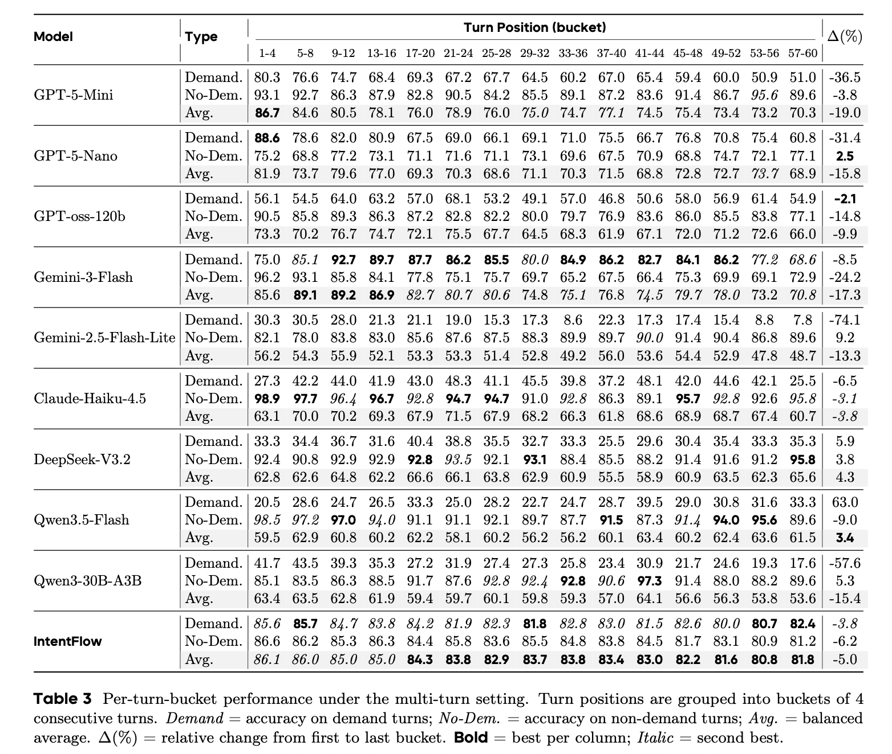
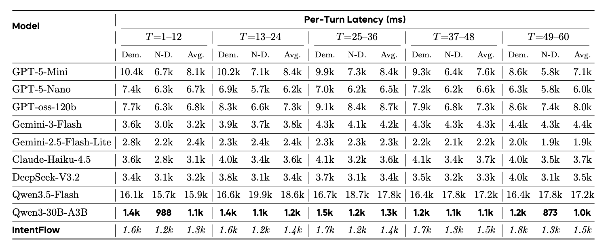
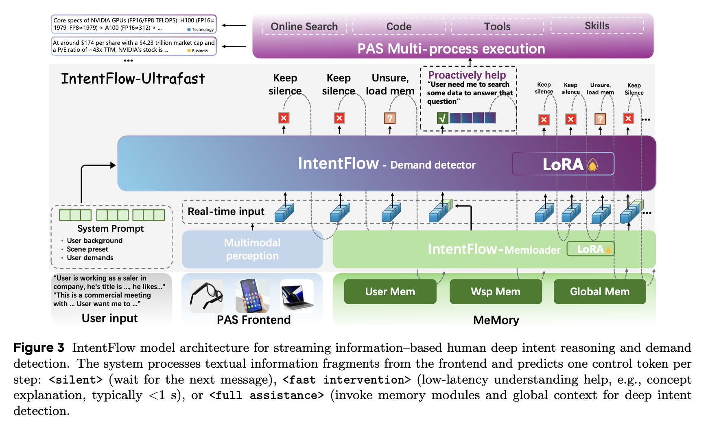
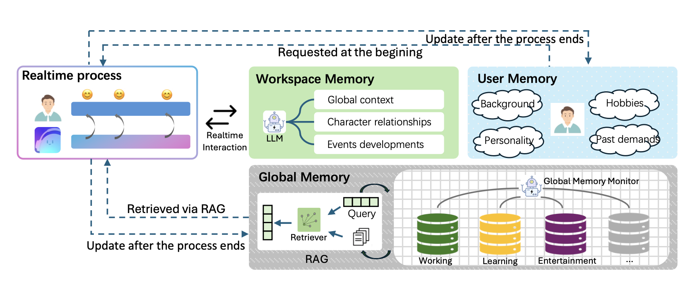
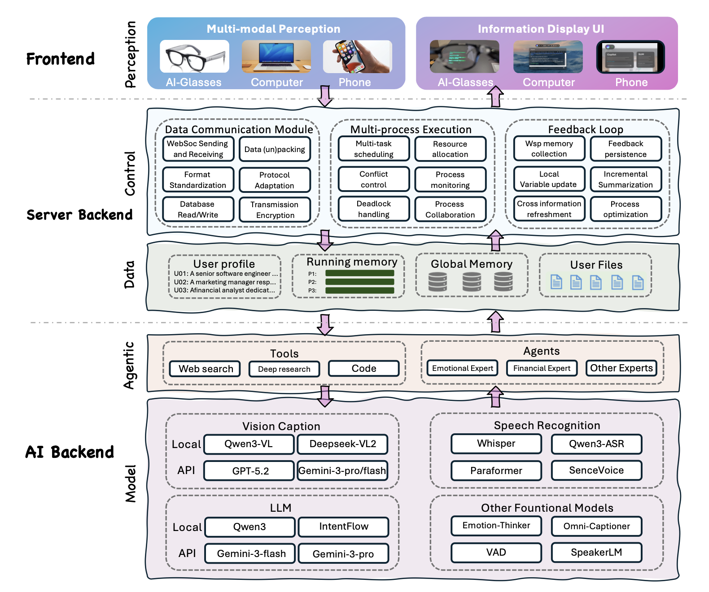

<div align="center">

</div>
<div align="center">
<a href='https://arxiv.org/pdf/2604.08000'></a>  
<a href='https://xzf-thu.github.io/Pask/'></a>  
<a href='https://x.com/XieZhifei14110'></a>
<a href='http://discord.gg/GQq35RaxSM'></a>  
</div>

<div align="center">
<a href='docs/assets/images/wechat.jpg'></a> <a href='https://pask.ai'></a>
</div>


> Proactivity is a core expectation for AGI. What should a truly proactive agent look like?

- **Precision** → we train IntentFlow, a dedicated model for real-time latent intent classification
- **Low Latency** → we design IntentFlow with a streaming architecture for per-turn online inference
- **Long-term Modeling** → we propose a hierarchical memory module for self-evolving user modeling across sessions

In this paper, we introduce **DD-MM-PAS**, a general paradigm of Demand Detection, Memory Modeling, and Proactive Agent System, for building low-latency, online proactive AI. We instantiate each component and show how they connect into a closed loop.


<div align="center">
  
</div>


## Brief Intro

<div align="center">
  <a href="https://www.youtube.com/watch?v=8hzfKYroO8k">
    
  </a>
</div>


## Demo Videos
<div align="center">
Pask in meetings.
</div>
<div align="center">
  <a href="https://www.youtube.com/watch?v=u-vsvtCs3ik">
    
  </a>
</div>
Proactive assistance during real-time conversations — meeting summaries, action items, and follow-up reminders.

<div align="center">

---

Pask in Learning.
</div>
<div align="center">
  <a href="https://www.youtube.com/watch?v=42qH6ddIib0">
    
  </a>
</div>
Personalized support for continuous knowledge building — concept guidance, adaptive review, and knowledge gap detection.


## LatentNeeds-Bench

### Quick Start

```bash
git clone https://github.com/xzf-thu/Pask.git
cd Pask

conda create -n pask python=3.10
conda activate pask
pip install -r requirements.txt
```

### Evaluation

```bash
# Run a model
python -m eval.run --models gpt-5-mini --level all

# Run on local vLLM
VLLM_BASE_URL=http://localhost:9000/v1 python -m eval.run --models qwen3-30b-a3b --level all

# Score with LLM-as-judge
python -m eval.score --models gpt-5-mini

# Summarize results
python -m eval.report

# Generate LaTeX tables & figures
python -m latex.latex_fill
python -m latex.plot
```

### Results

<div align="center">
  
  <p><i>Table 1: Main benchmark results. IntentFlow achieves the best balanced accuracy of 84.2.</i></p>
</div>

<div align="center">
  
  <p><i>Table 2: Breakdown by demand type (Work, Learning, Daily).</i></p>
</div>

<div align="center">
  
  <p><i>Table 3: Multi-turn accuracy degradation.</i></p>
</div>

<div align="center">
  
  <p><i>Table 4: Latency. IntentFlow achieves 1.3–1.5 s per turn.</i></p>
</div>

---

## Paper

### Abstract

Proactivity is a core expectation for AGI. Prior work remains largely confined to laboratory settings, leaving a clear gap with real-world proactive agents: depth, complexity, ambiguity, precision, and real-time constraints. We study this setting, where useful intervention requires **inferring latent needs from ongoing context** and grounding actions in **evolving user memory** under latency and long-horizon constraints.

We propose **DD-MM-PAS** (Demand Detection, Memory Modeling, Proactive Agent System) as a general paradigm for streaming proactive AI. We instantiate this in **Pask**, with the streaming **IntentFlow** model for demand detection, a hierarchical memory system (workspace, user, global) for long-term modeling, and the **PAS** infrastructure that closes the loop from detection to action.


### DD-MM-PAS

DD-MM-PAS decomposes proactive intelligence into three coupled functions: detecting what a user needs (DD), remembering who the user is over time (MM), and executing useful assistance (PAS). Each component can be studied and improved independently, while the full system operates as a closed loop.


### Pask-DD: IntentFlow

<div align="center">
  
</div>

IntentFlow reads a live conversation continuously and outputs one of three decisions at each turn: stay silent, respond immediately, or query memory before responding. The model is trained to make this judgment under streaming constraints, with outputs calibrated to minimize both false positives (unnecessary interruptions) and false negatives (missed needs).


### Pask-MM: Hierarchical Memory

<div align="center">
  
</div>

The memory system operates at three levels:

- **User Profile** — compact summary injected into every inference call; always-on, near-zero latency
- **Working Memory** — session-level state tracking current task context
- **Long-term Store** — retrieved via search when session context is insufficient

The system updates continuously across sessions, allowing Pask to personalize responses based on past interactions without manual configuration.


### Pask-PAS: System Architecture

<div align="center">
  
</div>

PAS connects frontend devices (glasses, phone, desktop) through a server layer to the full model and tool suite — web search, code execution, vision, and speech recognition. Detected intents are routed to the appropriate tool and returned to the user within the latency budget.


## Citation

```bibtex
@article{xie2025pask,
  title={Pask: Toward Intent-Aware Proactive Agents with Long-Term Memory},
  author={Xie, Zhifei and Hu, Zongzheng and Ye, Fangda and Zhang, Xin and Chai, Haobo and Liu, Zihang and Wu, Pengcheng and Zhang, Guibin and Liao, Yue and Hu, Xiaobin and Ye, Deheng and Miao, Chunyan and Yan, Shuicheng},
  journal={arXiv preprint arXiv:2604.08000},
  year={2025}
}
```

## License

[CC BY-NC-SA 4.0](https://creativecommons.org/licenses/by-nc-sa/4.0/)

---

<div align="center">
  <b>© 2026 Pask — Pask-Core · NTU · NUS</b>
</div>