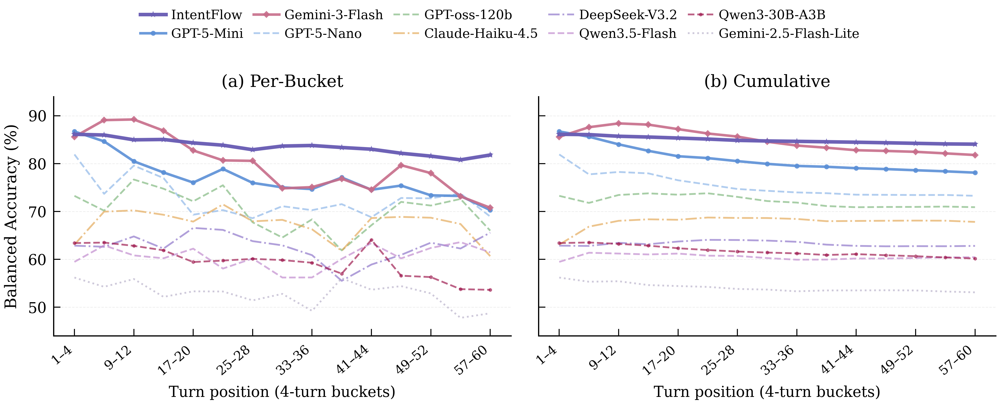

# IntentFlow

> Can an AI figure out what you need — before you even ask?

Most LLM assistants sit there waiting for you to type a question. IntentFlow flips this around: it listens to ongoing conversations and *proactively* jumps in when it spots an unspoken need — a knowledge gap, a forgotten follow-up, a risk nobody noticed.

This repo contains the **LatentNeeds-Bench** benchmark and evaluation framework from our paper.

## What's in the box

```
bench/          Data pipeline — raw transcripts → annotated benchmark
eval/           Run & score models (API or local vLLM)
latex/          Auto-generate paper tables & figures
```

## LatentNeeds-Bench

We built a benchmark from real multi-turn conversations to test whether models can detect *latent* user demands:

- **100 sessions**, **3,936 turns** across 10 topic categories
- 3 domains: Work, Learning, Daily Life
- Each turn labeled: does the user have an unspoken need? If so, what type?
- Two flavors: **Requirement** (user needs help doing something) and **Insight** (user would benefit from info they didn't ask for)
- Overall demand rate: 41.9%

See [`bench/PIPELINE.md`](bench/PIPELINE.md) for how the sausage is made.

## Results

We tested 9 baselines + IntentFlow across 3 prompt aggressiveness levels. Here's how they stack up:

| | Model | Type | Balanced Acc |
|---|-------|------|:-----------:|
| :crown: | **IntentFlow** | Ours | **84.2** |
| 2 | Gemini-3-Flash | API | 80.8 |
| 3 | GPT-5-Mini | API | 77.2 |
| 4 | GPT-5-Nano | API | 71.5 |
| 5 | GPT-oss-120b | Open | 70.3 |
| 6 | Claude-Haiku-4.5 | API | 66.2 |
| 7 | DeepSeek-V3.2 | Open | 61.6 |
| 8 | Qwen3.5-Flash | API | 61.1 |
| 9 | Qwen3-30B-A3B | Local | 58.9 |
| 10 | Gemini-2.5-Flash-Lite | API | 52.1 |

<details>
<summary><b>Full breakdown by subcategory (click to expand)</b></summary>

| Model | W1 | W2 | W3 | W4 | L1 | L2 | L3 | D1 | D2 | D3 | **Avg** |
|-------|:--:|:--:|:--:|:--:|:--:|:--:|:--:|:--:|:--:|:--:|:------:|
| **IntentFlow** | **80.6** | **87.2** | **86.9** | **79.4** | **86.1** | **88.1** | **86.5** | **83.6** | **86.4** | **77.0** | **84.2** |
| Gemini-3-Flash | 74.7 | 85.1 | 85.7 | 73.0 | 84.0 | 88.0 | 84.8 | 77.9 | 85.2 | 69.9 | 80.8 |
| GPT-5-Mini | 79.9 | 80.8 | 78.5 | 71.3 | 78.8 | 75.8 | 80.6 | 77.3 | 80.5 | 68.5 | 77.2 |
| GPT-5-Nano | 66.6 | 78.8 | 77.1 | 63.9 | 70.2 | 71.4 | 69.7 | 76.1 | 74.8 | 66.3 | 71.5 |
| GPT-oss-120b | 75.2 | 75.8 | 69.2 | 66.5 | 68.8 | 72.6 | 68.6 | 68.9 | 69.3 | 67.8 | 70.3 |
| Claude-Haiku-4.5 | 70.5 | 75.5 | 72.8 | 66.7 | 58.6 | 68.3 | 57.5 | 63.9 | 68.0 | 59.9 | 66.2 |
| DeepSeek-V3.2 | 60.5 | 66.4 | 62.2 | 60.1 | 53.5 | 57.5 | 54.9 | 71.0 | 71.2 | 58.6 | 61.6 |
| Qwen3.5-Flash | 63.7 | 63.0 | 58.1 | 56.5 | 61.0 | 63.5 | 62.9 | 60.9 | 61.5 | 59.8 | 61.1 |
| Qwen3-30B-A3B | 52.3 | 60.8 | 64.7 | 57.0 | 57.9 | 60.6 | 52.7 | 59.5 | 70.6 | 52.5 | 58.9 |
| Gemini-2.5-Flash-Lite | 49.4 | 55.5 | 48.0 | 51.0 | 52.8 | 52.8 | 51.9 | 59.1 | 55.2 | 45.1 | 52.1 |

Subcategories: **W**ork (W1 Business Metrics, W2 Product Strategy, W3 Tech Engineering, W4 Work Collaboration), **L**earning (L1 STEM, L2 Programming, L3 Humanities & Business), **D**aily (D1 Personal Life, D2 Tools & Workflow, D3 Content & Knowledge).

</details>

### Do models get worse as conversations go on?

Short answer: yes, most of them do.



The left plot shows accuracy in 4-turn windows — you can see the noise but the trend is clear. The right plot smooths it out cumulatively. IntentFlow stays above 80% throughout; Gemini-3-Flash starts strong at ~89% but slides to ~71% by turn 60.

## Quick start

```bash
# Run a model
python -m eval.run --models gpt-5-mini --level all

# Run on local vLLM
VLLM_BASE_URL=http://localhost:9000/v1 python -m eval.run --models qwen3-30b-a3b --level all

# Score with LLM-as-judge
python -m eval.score --models gpt-5-mini

# See how everyone did
python -m eval.report

# Generate LaTeX tables & figures
python -m latex.latex_fill
python -m latex.plot
```

## How scoring works

We use a **two-round LLM-as-judge** setup (GPT-4.1-Mini):

1. **Round 1**: Judge sees the current turn + ground truth annotation + model response. Makes a call: good, bad, or "I need more context."
2. **Round 2** (if needed): Judge gets the full conversation history and makes a final decision.

The primary metric is **balanced accuracy** — average of demand-turn recall and non-demand-turn precision — so a model can't game the score by just staying silent or always responding.
